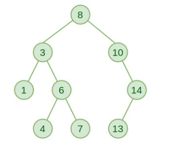
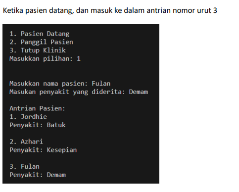
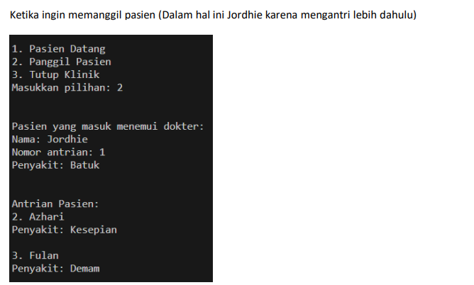

# Tugas Praktikum Modul 7

Nama : [Change Me]

NPM : [Change Me]

# Soal Teori

## 1. Jelaskan secara apa itu data structure stack dan queue! Apa yang dimaksud dengan FIFO dan LIFO? (20 poin)

Lorem ipsum dolor sit amet, consectetur adipiscing elit, sed do eiusmod tempor incididunt ut labore et dolore magna aliqua. Non curabitur gravida arcu ac tortor. Dapibus ultrices in iaculis nunc sed augue. Orci ac auctor augue mauris augue neque. Dictumst vestibulum rhoncus est pellentesque elit. In ornare quam viverra orci. Purus semper eget duis at tellus at urna condimentum. Vitae justo eget magna fermentum iaculis eu. Venenatis a condimentum vitae sapien pellentesque. Faucibus scelerisque eleifend donec pretium vulputate. Nisl pretium fusce id velit ut tortor pretium viverra suspendisse. Vitae sapien pellentesque habitant morbi tristique senectus.

### Referensi :

## 2. Jelaskan dan bandingkan operasi yang dapat dilakukan dalam stack dan queue! (20 poin)

Lorem ipsum dolor sit amet, consectetur adipiscing elit, sed do eiusmod tempor incididunt ut labore et dolore magna aliqua. Non curabitur gravida arcu ac tortor. Dapibus ultrices in iaculis nunc sed augue. Orci ac auctor augue mauris augue neque. Dictumst vestibulum rhoncus est pellentesque elit. In ornare quam viverra orci. Purus semper eget duis at tellus at urna condimentum. Vitae justo eget magna fermentum iaculis eu. Venenatis a condimentum vitae sapien pellentesque. Faucibus scelerisque eleifend donec pretium vulputate. Nisl pretium fusce id velit ut tortor pretium viverra suspendisse. Vitae sapien pellentesque habitant morbi tristique senectus.

### Referensi :

## 3. Jelaskan use case dari stack dan queue. Jelaskan pula apa itu priority queue dan use casenya! (20 poin)

Lorem ipsum dolor sit amet, consectetur adipiscing elit, sed do eiusmod tempor incididunt ut labore et dolore magna aliqua. Non curabitur gravida arcu ac tortor. Dapibus ultrices in iaculis nunc sed augue. Orci ac auctor augue mauris augue neque. Dictumst vestibulum rhoncus est pellentesque elit. In ornare quam viverra orci. Purus semper eget duis at tellus at urna condimentum. Vitae justo eget magna fermentum iaculis eu. Venenatis a condimentum vitae sapien pellentesque. Faucibus scelerisque eleifend donec pretium vulputate. Nisl pretium fusce id velit ut tortor pretium viverra suspendisse. Vitae sapien pellentesque habitant morbi tristique senectus.
### Referensi :
## 4. Jelaskan apa yang dimaksud dengan data structure tree dan metode traversal yang ada! (30 poin)
### Contoh: Bagaimana proses insertion suatu node pada Linked List
Lorem ipsum dolor sit amet, consectetur adipiscing elit, sed do eiusmod tempor incididunt ut labore et dolore magna aliqua. Non curabitur gravida arcu ac tortor. Dapibus ultrices in iaculis nunc sed augue. Orci ac auctor augue mauris augue neque. Dictumst vestibulum rhoncus est pellentesque elit. In ornare quam viverra orci. Purus semper eget duis at tellus at urna condimentum. Vitae justo eget magna fermentum iaculis eu. Venenatis a condimentum vitae sapien pellentesque. Faucibus scelerisque eleifend donec pretium vulputate. Nisl pretium fusce id velit ut tortor pretium viverra suspendisse. Vitae sapien pellentesque habitant morbi tristique senectu.

## 5. Apakah ketiga data structure tersebut merupakan data structure linier? Jelaskan alasannya. Bagaimana data structure tersebut dapat diterapkan dalam C ? (10 poin)

Lorem ipsum dolor sit amet, consectetur adipiscing elit, sed do eiusmod tempor incididunt ut labore et dolore magna aliqua. Non curabitur gravida arcu ac tortor. Dapibus ultrices in iaculis nunc sed augue. Orci ac auctor augue mauris augue neque. Dictumst vestibulum rhoncus est pellentesque elit. In ornare quam viverra orci. Purus semper eget duis at tellus at urna condimentum. Vitae justo eget magna fermentum iaculis eu. Venenatis a condimentum vitae sapien pellentesque. Faucibus scelerisque eleifend donec pretium vulputate. Nisl pretium fusce id velit ut tortor pretium viverra suspendisse. Vitae sapien pellentesque habitant morbi tristique senectus.

# Soal Pemrograman

## 1. Binary Tree Traversal (40 Poin)

Buatlah tree tersebut dalam program C, lalu lakukan traversal untuk menampilkan seluruh elemen dari tree.
### Video: Jelaskan kode yang telah anda buat. Jelaskan cara kerja metode traversal yang anda gunakan!

## 2. Sistem Rumah Sakit (60 poin)
### Program boleh dibuat dengan array atau linked list

Rumah Sakit Digi melayani semua jenis penyakit. Namun, rumah sakit tersebut hanya memiliki seorang dokter yaitu Dr. Naufal dan pasien yang datang ke rumah sakit tersebut sangatlah banyak. Terkadang tak jarang, pasien di sana berebutan antrean untuk menemui dokter Naufal. 

Untuk menyelesaikan masalah tersebut, buatlah suatu program antrian dalam data structure Queue. Program tersebut dapat terdiri dari 3 fitur yaitu: 
- A. Pasien Datang : Menu ini akan menginput setiap pasien yang datang dengan nama pasien, nama penyakit, dan nomor antrian. Untuk nomor antrian akan otomatis ditentukan oleh sistem.
- B. Memanggil Pasien : Menu ini akan memanggil pasien berdasarkan prinsip “queue” 
- C. Keluar program : Mengakhiri program (klinik tutup) Contoh program (tampilan input dan output dibebaskan): Ketika pasien datang, dan masuk ke dalam antrian nomor urut 3

Contoh :

### Video: Jelaskan alur program yang dibuat. Bagaimana peran FIFO dari queue diterapkan dalam program? Apakah anda menerapkan program menggunakan array atau linked list? Dapatkah keduanya digunakan dalam kasus ini?

